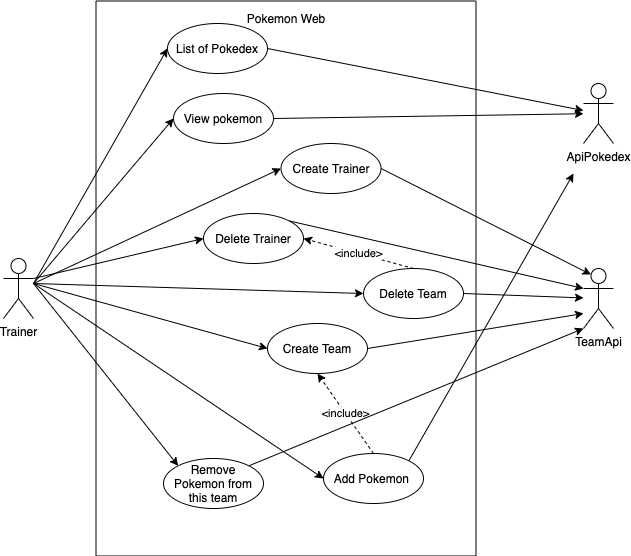
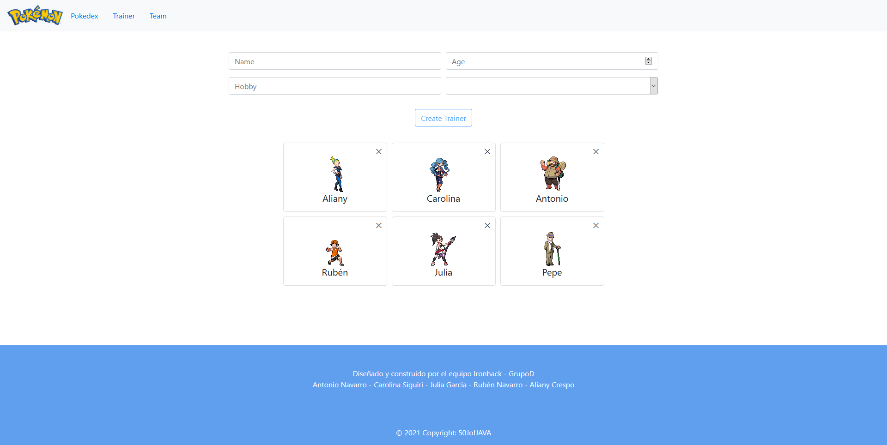
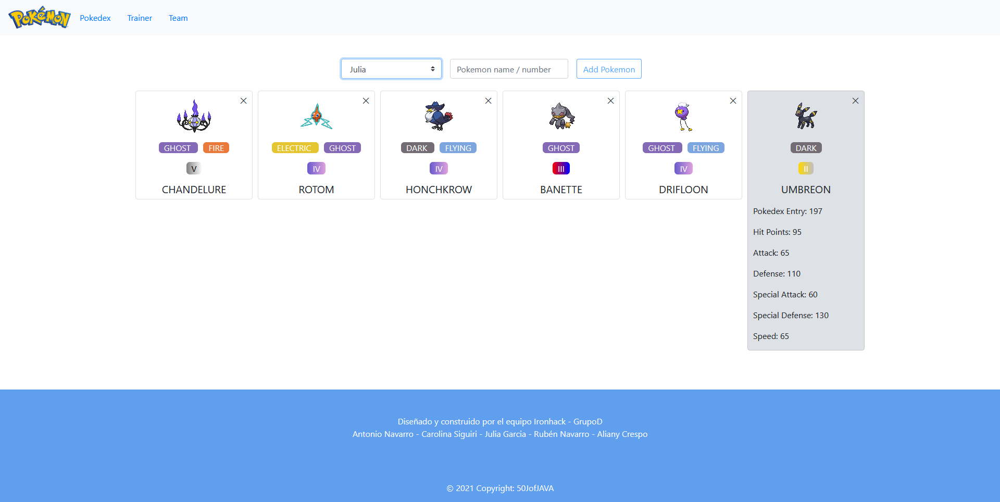
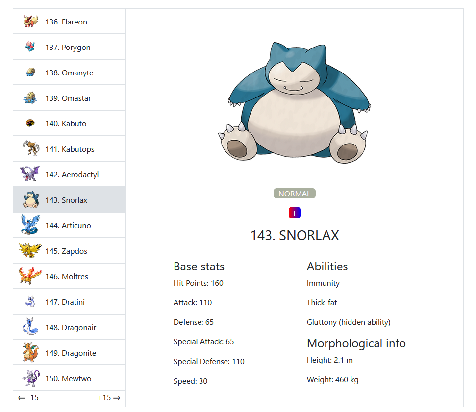

# JaPoKemon 
For this project, we created a Pokémon application, in this application we have 3 sections, Pokedex, Teams and Trainers. In Pokedex we are presented with a paginated list of all the names of the pokemons, and clicking on a name shows a detailed view of the pokedex with an image and statistics.
In Trainers we can create and eliminate pokemon trainers. In Teams, we can select a trainer and see their pokemon team, add and / or remove pokemons to that team.

 `Have fun creating your pokemon team to accompany you on this adventure!`


## Starting 🚀


This project has a backend application developed in Java with Spring Boot and a frontend application developed in Angular with Boostraps. Both applications communicate with each other through an API.


### Installation 🔧
---

These instructions will allow you to get a copy of the project running on your local machine.

1. Download the project from the repository.

2. Follow the path below to download the schematic from the DB on your computer. Then open the schema with a DB manager and create the project tables.

```
'/src/main/resources/static/PokemonTables.sql'
```

4. Go to this repository's application.properties file and replace these lines with your mySQL username and password.

```
'spring.datasource.username=username' and 'spring.datasource.password=password'
```

5. Open the teamApi application with Intellij IDEA and run this command in terminal.

```
mvn spring-boot:run
```

6. Open the pokemon application with Visual Studio Code and run this command to lift the application in angular.

```
ng serve
```

7. Go to your browser and type the following path to open the project.

```
http://localhost:4200/
```


_Ready! you can now have fun on your computer with JaPokemon._


## Routes ✒️

REST | Route | name  |
| ------| ------ | ------ |
GET | localhost:8080/teams | Get all teams with the whole information about its trainers and pokemons |
PUT | localhost:8080/add/{teamId}/team-mate| Add a new pokemon to the team |
PATCH | localhost:8080/remove/{teamId}/team-mate | Remove a team mate from the team|
POST | localhost:8080/trainer | Create a trainer and automatically create its team|
GET | localhost:8080/trainers | Get all trainers|
DELETE | localhost:8080/trainer/{id} | Delete a trainer and automatically delete its team |


# Diagrams
Case Diagram



# Screenshots




---
⌨️ developed with ❤️ by Antonio Navarro, Carolina Siguiri, Julia Garcia, Rubén Navarro, Aliany Crespo 😊
